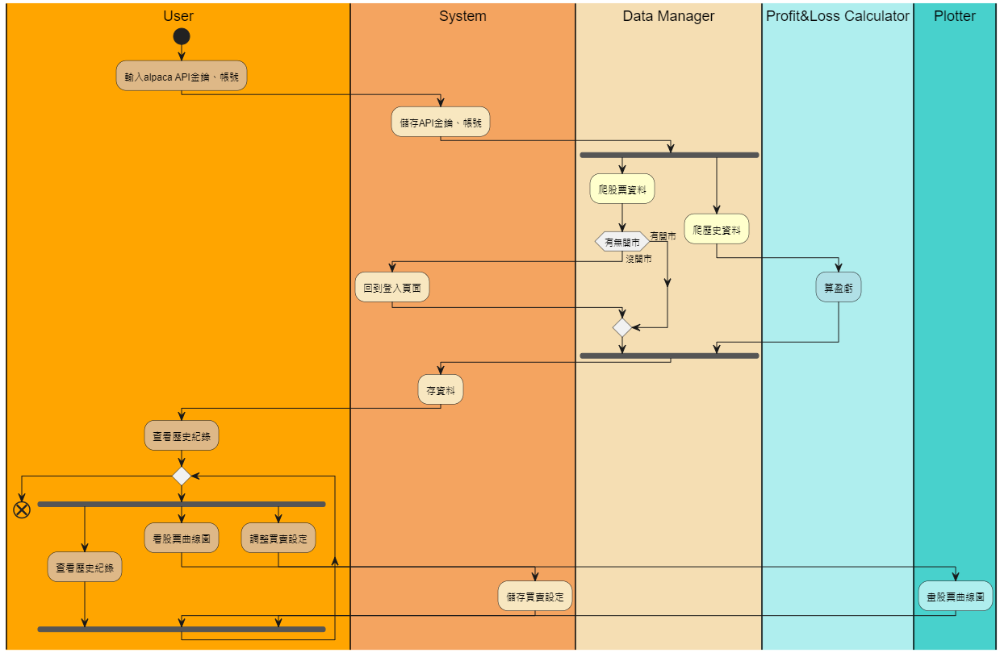

# 股票機器人

## 目的：
1. 測試買賣策略是否有效

 

## 股票模擬網站
* https://alpaca.markets/
* Paper Trading Simulation API: https://docs.alpaca.markets/docs/trading-api

 

## 功能：
### 1. 爬資料 `Data`
> * 用 alpaca API 來爬
> 1. 股票的資料
> > * 股價 : **待議，看API提供多快**
> > * 名稱 : **開啟時抓**
> > * Ｋ線 : **開啟時抓**
> > （開盤、收盤、最高、最低） 
> 2. 歷史資料 : **每次交易後就更新**
> > * 買賣紀錄 
> > * 獲利、賠本（漲跌區，綠、紅） 

### 2. 交易 `Trade`
> * 用 alpaca API 來買入賣出
> * 根據股價更新速度來決定要不要買賣
> * 股票更新速率 4 分鐘

### 3. 買賣設定
> 1. 設定多少錢買 
> 2. 設定隔多少錢要賣 
> 3. 設定隔多少錢要買 
> 4. 分別設定每個股票的買賣價格 

### 4. 買賣建議
> 1. K線 
> 2. 股票曲線圖 

### 5. 登入
> 1. 使用者 (user) 
> > * 一開始要輸入。要用來交易的 alpaca 帳號
> > * 沒帳號要跳轉到alpaca網頁 
> > * 會存起來
> 2. 股票機器人 (agent) 
> > * 用使用者一開始輸的帳號來登入

### 6. 不用的東西
> 1. 使用者的金額

 

## GUI
> 1. 股票頁面 
> > * 顯示 K線、股票曲線圖 
> > * 股票名、股價 
> > * 買賣設定 
> 2. 歷史紀錄頁面 
> > * 買賣紀錄 
> > * 獲利、賠本（顯示 綠、紅）
> 3. 登入頁面 
> 
> ### 草稿： 
> 

 

## 架構：
### Use Case
>  

### Activity Diagram
>  
>  

### system、GUI 的功能
>  

 

## 分工表：
> 
